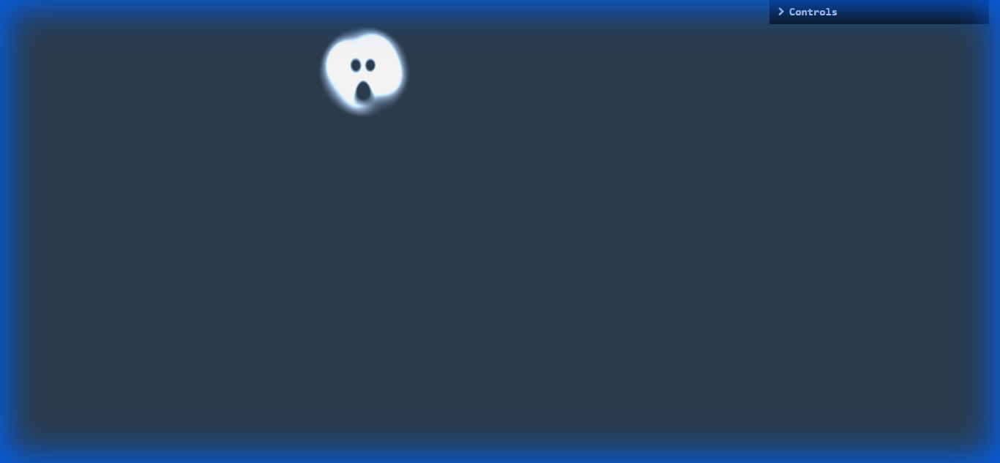
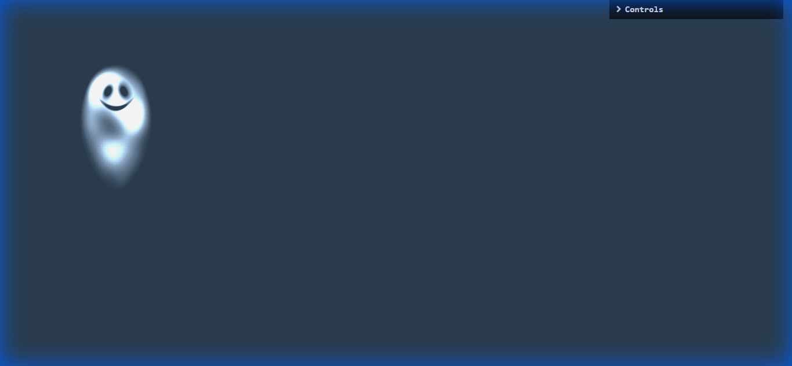
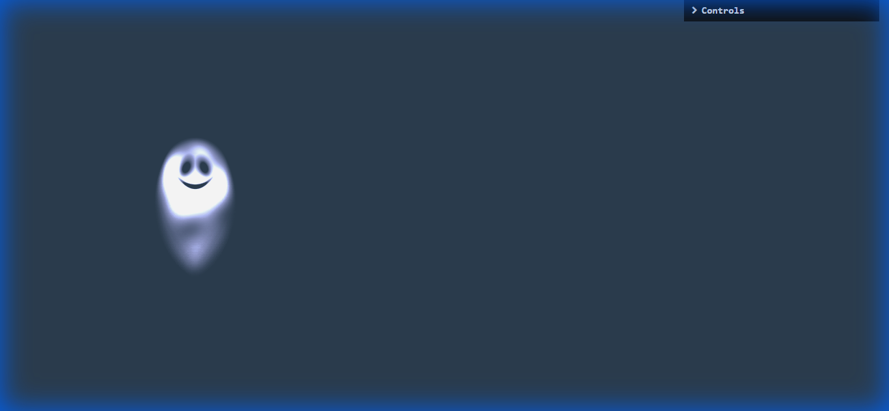

# 👻 Cursor Fantasma


Um cursor de mouse animado em formato de fantasma com efeitos WebGL e shaders personalizados. Perfeito para adicionar um toque interativo e divertido ao seu site!

## 📸 Preview do Projeto

<div align="center">



*Cursor fantasma com sorriso*



*Cursor fantasma seguindo o movimento*



*Interface com controles personalizáveis*

</div>

## ✨ Características

- 👻 Animação suave de fantasma que segue o cursor
- 🎨 Efeitos visuais com WebGL e shaders GLSL
- 🎭 Expressões dinâmicas (sorriso/surpresa)
- 🌊 Rastro flutuante com física personalizada
- 🎮 Controles interativos (tamanho, cores, etc.)
- 📱 Responsivo e otimizado para performance

## 🚀 Como Implementar no Seu Site

### Método 1: Implementação Completa

1. **Baixe os arquivos do projeto** ou clone o repositório:
```bash
git clone https://github.com/Guielihan/cursor-fantasma.git
```

2. **Copie os arquivos necessários** para o seu projeto:
```
seu-projeto/
├── css/
│   └── style.css
├── js/
│   ├── shader.js
│   ├── canvas.js
│   └── script.js
└── index.html
```

3. **Adicione o HTML** no seu arquivo HTML (dentro do `<body>`):
```html
<!-- Canvas do cursor fantasma -->
<canvas id="ghost"></canvas>

<!-- Shaders WebGL -->
<script type="x-shader/x-fragment" id="vertShader">
    precision mediump float;
    varying vec2 vUv;
    attribute vec2 a_position;

    void main() {
        vUv = .5 * (a_position + 1.);
        gl_Position = vec4(a_position, 0.0, 1.0);
    }
</script>

<script type="x-shader/x-fragment" id="fragShader">
    precision mediump float;

    varying vec2 vUv;
    uniform float u_time;
    uniform float u_ratio;
    uniform float u_size;
    uniform vec2 u_pointer;
    uniform float u_smile;
    uniform vec2 u_target_pointer;
    uniform vec3 u_main_color;
    uniform vec3 u_border_color;
    uniform float u_flat_color;
    uniform sampler2D u_texture;

    #define TWO_PI 6.28318530718
    #define PI 3.14159265358979323846

    vec3 mod289(vec3 x) { return x - floor(x * (1.0 / 289.0)) * 289.0; }
    vec2 mod289(vec2 x) { return x - floor(x * (1.0 / 289.0)) * 289.0; }
    vec3 permute(vec3 x) { return mod289(((x*34.0)+1.0)*x); }
    
    float snoise(vec2 v) {
        const vec4 C = vec4(0.211324865405187, 0.366025403784439, -0.577350269189626, 0.024390243902439);
        vec2 i = floor(v + dot(v, C.yy));
        vec2 x0 = v - i + dot(i, C.xx);
        vec2 i1;
        i1 = (x0.x > x0.y) ? vec2(1.0, 0.0) : vec2(0.0, 1.0);
        vec4 x12 = x0.xyxy + C.xxzz;
        x12.xy -= i1;
        i = mod289(i);
        vec3 p = permute(permute(i.y + vec3(0.0, i1.y, 1.0)) + i.x + vec3(0.0, i1.x, 1.0));
        vec3 m = max(0.5 - vec3(dot(x0, x0), dot(x12.xy, x12.xy), dot(x12.zw, x12.zw)), 0.0);
        m = m*m;
        m = m*m;
        vec3 x = 2.0 * fract(p * C.www) - 1.0;
        vec3 h = abs(x) - 0.5;
        vec3 ox = floor(x + 0.5);
        vec3 a0 = x - ox;
        m *= 1.79284291400159 - 0.85373472095314 * (a0*a0 + h*h);
        vec3 g;
        g.x = a0.x * x0.x + h.x * x0.y;
        g.yz = a0.yz * x12.xz + h.yz * x12.yw;
        return 130.0 * dot(m, g);
    }
    
    vec2 rotate(vec2 v, float angle) {
        float r_sin = sin(angle);
        float r_cos = cos(angle);
        return vec2(v.x * r_cos - v.y * r_sin, v.x * r_sin + v.y * r_cos);
    }

    float eyes(vec2 uv) {
        uv.y -= .5;
        uv.x *= 1.;
        uv.y *= .8;
        uv.x = abs(uv.x);
        uv.y += u_smile * .3 * pow(uv.x, 1.3);
        uv.x -= (.6 + .2 * u_smile);
        float d = clamp(length(uv), 0., 1.);
        return 1. - pow(d, .08);
    }

    float mouth(vec2 uv) {
        uv.y += 1.5;
        uv.x *= (.5 + .5 * abs(1. - u_smile));
        uv.y *= (3. - 2. * abs(1. - u_smile));
        uv.y -= u_smile * 4. * pow(uv.x, 2.);
        float d = clamp(length(uv), 0., 1.);
        return 1. - pow(d, .07);
    }

    float face(vec2 uv, float rotation) {
        uv = rotate(uv, rotation);
        uv /= (.27 * u_size);
        float eyes_shape = 10. * eyes(uv);
        float mouth_shape = 20. * mouth(uv);
        float col = 0.;
        col = mix(col, 1., eyes_shape);
        col = mix(col, 1., mouth_shape);
        return col;
    }

    void main() {
        vec2 point = u_pointer;
        point.x *= u_ratio;
        vec2 uv = vUv;
        uv.x *= u_ratio;
        uv -= point;

        float texture = texture2D(u_texture, vec2(vUv.x, 1. - vUv.y)).r;
        float shape = texture;

        float noise = snoise(uv * vec2(.7 / u_size, .6 / u_size) + vec2(0., .0015 * u_time));
        noise += 1.2;
        noise *= 2.1;
        noise += smoothstep(-.8, -.2, (uv.y) / u_size);

        float face = face(uv, 5. * (u_target_pointer.x - u_pointer.x));
        shape -= face;
        shape *= noise;

        vec3 border = (1. - u_border_color);
        border.g += .2 * sin(.005 * u_time);
        border *= .5;

        vec3 color = u_main_color;
        color -= (1. - u_flat_color) * border * smoothstep(.0, .01, shape);

        shape = u_flat_color * smoothstep(.8, 1., shape) + (1. - u_flat_color) * shape;
        color *= shape;

        gl_FragColor = vec4(color, shape);
    }
</script>

<!-- Scripts -->
<script src="https://cdn.jsdelivr.net/npm/lil-gui@0.18/dist/lil-gui.umd.min.js"></script>
<script src="js/shader.js"></script>
<script src="js/canvas.js"></script>
<script src="js/script.js"></script>
```

4. **Adicione o CSS** ao seu arquivo de estilos ou copie `style.css`:
```css
canvas#ghost {
    position: fixed;
    top: 0;
    left: 0;
    display: block;
    width: 100%;
    z-index: 10000;
    pointer-events: none;
}
```

### Método 2: Implementação Simplificada

Para uma implementação rápida, você pode usar o GitHub Pages:

1. Acesse: `https://guielihan.github.io/cursor-fantasma/`
2. Copie os arquivos necessários
3. Ajuste conforme sua necessidade

## 🎮 Controles Disponíveis

O cursor fantasma inclui controles personalizáveis (canto superior direito):

- **Size**: Tamanho do fantasma (0.02 - 0.3)
- **Main Color**: Cor principal do fantasma
- **Border Color**: Cor da borda/contorno
- **Flat Color**: Ativa/desativa cor sólida

## 🛠️ Tecnologias Utilizadas

- **HTML5** - Estrutura
- **CSS3** - Estilização
- **JavaScript (ES6+)** - Lógica e interatividade
- **WebGL** - Renderização de gráficos
- **GLSL** - Shaders personalizados
- **lil-gui** - Interface de controles

## 📁 Estrutura do Projeto

```
cursor-fantasma/
├── assets/              # Capturas de tela
│   ├── preview-1.png
│   ├── preview-2.png
│   └── preview-3.png
├── css/
│   └── style.css       # Estilos do cursor
├── js/
│   ├── shader.js       # Configuração de shaders WebGL
│   ├── canvas.js       # Gerenciamento de canvas
│   └── script.js       # Script principal
├── index.html          # Página principal
├── .gitignore
└── README.md
```

## 👨‍💻 Desenvolvedor

<div align="center">

### **Guilherme Queiroz (Guielihan)**

Desenvolvedor Full Stack apaixonado por criar experiências web interativas e inovadoras.

[](https://discord.com/users/1297971679737413632)
[](https://www.instagram.com/devguielihan/)
[](mailto:devguielihan@gmail.com)

</div>

## 📝 Licença

Este projeto está sob a licença MIT. Sinta-se livre para usar, modificar e distribuir.

## 🤝 Contribuindo

Contribuições são bem-vindas! Sinta-se à vontade para:

1. Fazer um Fork do projeto
2. Criar uma branch para sua feature (`git checkout -b feature/NovaFeature`)
3. Commit suas mudanças (`git commit -m 'Adiciona nova feature'`)
4. Push para a branch (`git push origin feature/NovaFeature`)
5. Abrir um Pull Request

## ⭐ Suporte

Se você gostou deste projeto, considere dar uma ⭐ no repositório!

---

<div align="center">
Feito com 👻 e ❤️ por <strong>Guilherme Queiroz</strong>
</div>
